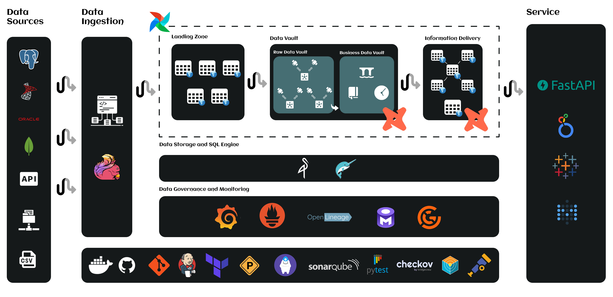

# Modern Data Stack

Ainda estou desenvolvendo este repositorio, qualquer coisa pode me chamar no LinkedIn.

Esse repositório foi criado com o objetivo de estudar e construir uma arquitetura de dados moderna, seguindo os melhores padrões.

## Arquitetura do Ambiente



### Visão Geral

A arquitetura implementada utiliza um conjunto de tecnologias modernas e open-source para criar um ambiente completo de dados, desde a ingestão até o consumo, com foco em governança, qualidade e observabilidade.

## Stack Tecnológica

### 🔄 **Data Ingestion**
- **Apache Flink**: Processamento de streaming em tempo real
- **Framework Personalizado**: Conectores customizados para fontes específicas

### 🌊 **Ambiente de Dados**
- **Apache Airflow**: Orquestração de workflows
- **Landing Zone**: Camada de dados brutos com Apache Iceberg
- **Data Vault**: Modelagem de dados historizada
- **Business Vault**: Regras de negócio aplicadas
- **Information Schema**: 
  - **OBT (One Big Table)**: Tabelas desnormalizadas
  - **Star Schema**: Modelagem dimensional

### ⚙️ **Data Processor**
- **dbt (Data Build Tool)**: Transformações de dados em SQL

### 💾 **Data Storage and SQL Engine**
- **MinIO**: Armazenamento de objetos S3-compatível
- **Dremio**: Engine SQL distribuído e virtualização de dados

### 📊 **Data Governance and Monitoring**
- **Grafana**: Dashboards de monitoramento e observabilidade
- **Prometheus**: Coleta de métricas e alertas
- **OpenLineage**: Rastreamento de linhagem de dados
- **OpenMetadata**: Catálogo de dados e descoberta
- **Great Expectations**: Validação e qualidade de dados

### 🔧 **Services**
- **FastAPI**: APIs REST para exposição de dados
- **Metabase**: Business Intelligence open-source
- **Looker**: Plataforma de BI empresarial
- **Tableau**: Visualização avançada de dados

### 🏗️ **Infraestrutura**
- **Docker**: Containerização de aplicações
- **GitHub**: Controle de versão e colaboração
- **Git**: Versionamento de código
- **Jenkins**: Servidor de CI/CD para automação de builds e deploys
- **Terraform**: Infrastructure as Code
- **Terragrunt**: Wrapper para Terraform
- **Pre-commit**: Hooks de validação
- **SonarQube**: Análise de qualidade de código
- **Pytest**: Testes automatizados
- **Checkov**: Scanner de segurança para Infrastructure as Code (Terraform, Docker, K8s)
- **Trivy**: Scanner de vulnerabilidades para containers e dependências
- **OpenTelemetry**: Observabilidade distribuída com traces, métricas e logs

## Estrutura do Repositório

```
data-stack/
├── docs/
│   └── images/           # Diagramas da arquitetura
├── airflow/              # DAGs do Airflow
├── dbt/                  # Transformações dbt
├── infra/                # Infrastructure as Code
├── docker/               # Containers e docker-compose
├── tests/                # Testes automatizados
├── scripts/              # Scripts de setup e utilitários
└── README.md             # Documentação principal
```

## TO DO

### 📋 **Fase 0: Infraestrutura Base**
- [ ] **Setup do Ambiente Local**
  - [ ] Criar módulos Terraform
  - [ ] Setup do MinIO local
  - [ ] Configurar Dremio local
  - [ ] Setup básico do Airflow

- [ ] **Infrastructure as Code**
  - [ ] Criar módulos Terraform para MinIO
  - [ ] Configurar Terragrunt para ambientes (dev/staging/prod)
  - [ ] Implementar Terraform para Flink cluster

- [ ] **CI/CD Pipeline**
  - [ ] Configurar Jenkins pipeline
  - [ ] Integrar Pre-commit hooks
  - [ ] Setup do SonarQube para análise de código
  - [ ] Configurar Checkov para validação de IaC
  - [ ] Implementar Trivy para scan de vulnerabilidades

### 📋 **Fase 1: Framework**
- [ ] **Construcao do Framework**
  - [ ] Organizacao do ambiente/pastas
  - [ ] Configuracao para extracoes JDBC
  - [ ] Configuracao para extracoes API
  - [ ] Configuracao para extracoes Arquivos
  - [ ] Configuracao para extracoes Streaming
  - [ ] Inclusao de testes
  - [ ] Inclusao de datasources

### 📊 **Fase 2: Data Ingestion & Processing**
- [ ] **Apache Flink**
  - [ ] Setup do cluster Flink
  - [ ] Desenvolver framework personalizado de conectores
  - [ ] Implementar jobs de streaming
  - [ ] Configurar checkpointing e recovery

- [ ] **Landing Zone (Iceberg)**
  - [ ] Configurar Apache Iceberg no MinIO
  - [ ] Implementar particionamento inteligente
  - [ ] Setup de compactação automática
  - [ ] Configurar schema evolution

- [ ] **Apache Airflow**
  - [ ] Criar DAGs para orquestração
  - [ ] Implementar sensores para dados
  - [ ] Configurar alertas e monitoramento
  - [ ] Setup de retry policies

### 🔄 **Fase 3: Data Transformation**
- [ ] **dbt Implementation**
  - [ ] Setup do projeto dbt
  - [ ] Implementar Data Vault (Hubs, Links, Satellites)
  - [ ] Desenvolver Business Vault
  - [ ] Criar Information Schema (OBT + Star Schema)
  - [ ] Implementar testes de qualidade
  - [ ] Configurar documentação automática

- [ ] **Great Expectations**
  - [ ] Setup do framework de qualidade
  - [ ] Criar expectativas para cada camada
  - [ ] Integrar com Airflow
  - [ ] Configurar alertas de qualidade

### 📈 **Fase 4: Governança & Monitoring**
- [ ] **OpenLineage**
  - [ ] Integrar com Airflow
  - [ ] Configurar tracking do dbt
  - [ ] Implementar lineage do Flink
  - [ ] Setup de visualização

- [ ] **OpenMetadata**
  - [ ] Setup do catálogo de dados
  - [ ] Configurar descoberta automática
  - [ ] Implementar classificação de dados
  - [ ] Setup de políticas de acesso

- [ ] **Observabilidade**
  - [ ] Implementar OpenTelemetry
  - [ ] Configurar Prometheus para métricas
  - [ ] Setup do Grafana com dashboards
  - [ ] Configurar alertas inteligentes

### 🎯 **Fase 5: Data Consumption**
- [ ] **APIs & Services**
  - [ ] Desenvolver APIs FastAPI
  - [ ] Integrar com Dremio
  - [ ] Implementar autenticação/autorização
  - [ ] Setup de rate limiting

- [ ] **Business Intelligence**
  - [ ] Configurar Metabase
  - [ ] Criar dashboards padrão
  - [ ] Setup de self-service analytics

### 🔒 **Fase 6: Segurança & Compliance**
- [ ] **Segurança**
  - [ ] Implementar encryption at rest/transit
  - [ ] Configurar RBAC no Dremio
  - [ ] Setup de auditoria
  - [ ] Implementar data masking

- [ ] **Compliance**
  - [ ] Implementar LGPD compliance
  - [ ] Setup de data retention policies
  - [ ] Configurar right to be forgotten
  - [ ] Documentar data lineage para compliance

### 🧪 **Fase 7: Testes & Qualidade**
- [ ] **Testing Strategy**
  - [ ] Implementar unit tests (Pytest)
  - [ ] Criar integration tests
  - [ ] Setup de performance tests
  - [ ] Implementar data quality tests

- [ ] **Automação**
  - [ ] Configurar deploy automático
  - [ ] Setup de rollback automático
  - [ ] Implementar feature flags
  - [ ] Configurar blue-green deployment

### 📚 **Fase 8: Documentação**
- [ ] **Documentação**
  - [ ] Documentar APIs
  - [ ] Documentar processos operacionais
  - [ ] Setup de knowledge base

- [ ] **Capacitação**
  - [ ] Documentar best practices
  - [ ] Setup de sandbox environment

